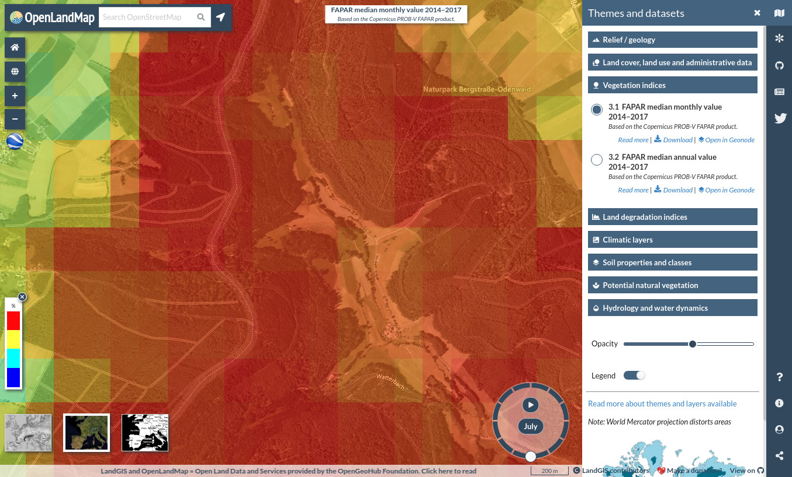
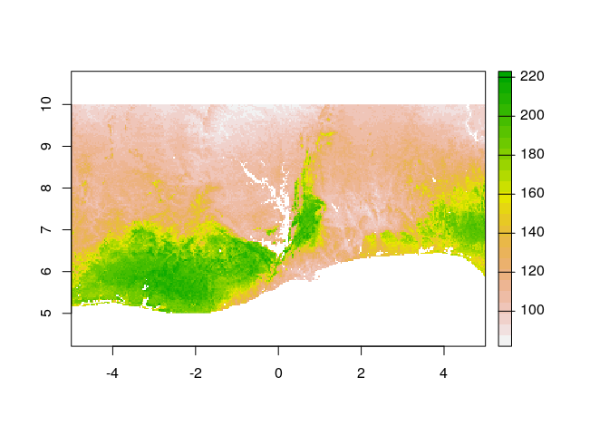

OpenLandMap data cube: accessing, understanding and using COG’s
================
Tomislav Hengl
(<a href="mailto:tom.hengl@opengeohub.org" class="email">tom.hengl@opengeohub.org</a>)
and Leandro Parente
(<a href="mailto:leandro.parente@opengeohub.org" class="email">leandro.parente@opengeohub.org</a>)
03 February, 2021

-   [OpenLandMap on Wasabi / Cloud-Optimized
    GeoTIFF](#openlandmap-on-wasabi-cloud-optimized-geotiff)
    -   [*Listing all layers available*](#listing-all-layers-available)
    -   [*Viewing data in QGIS*](#viewing-data-in-qgis)
-   [ Accessing data
    from R](#alt-text-accessing-data-from-r)
    -   [*Point queries*](#point-queries)
    -   [*Cropping files to smaller
        areas*](#cropping-files-to-smaller-areas)
-   [References](#references)

This work is licensed under a [Creative Commons Attribution-ShareAlike
4.0 International
License](http://creativecommons.org/licenses/by-sa/4.0/).

OpenLandMap on Wasabi / Cloud-Optimized GeoTIFF
-----------------------------------------------

Part of: [OpenLandMap global
layers](https://gitlab.com/openlandmap/global-layers)  
Last update: 2021-02-03

[Cloud-Optimized GeoTIFFs](https://www.cogeo.org/) are post-processed
images that are optimized for file sharing and can be considered to be
equivalent to Geospatial databases as they can serve spatial queries
(Kulkarni, Stano, Conover, Graves, & Maskey,
[2019](#ref-kulkarni2019cloud)). All OpenLandMap layers available via
the data portal are, in principle, immediately made available via our
file service, hosted on Wasabi.com.

In this tutorial we explain how to access Cloud Optimized GeoTiffs-COG
files, query values for COG’s at point locations, retrieve the raster
data only for a specific geographic window (crop images) and run more
advanced spatial analysis. We focus mainly on the R programming
language, although you could also implement the similar functionality
[using
python](https://gitlab.com/geoharmonizer_inea/eumap/-/tree/master/demo/python)
or similar.

#### *Listing all layers available*

To list all GeoTIFs available via the OpenLandMap Wasabi service you can
use **[this
table](https://gitlab.com/openlandmap/global-layers/-/tree/master/tables/openlandmap_wasabi_files.csv)**.
The detailed description of all layers is available from
<https://gitlab.com/openlandmap/global-layers/>. At the moment, almost
all layers that are visible via www.openlandmap.org can also be accessed
via the OpenLandMap Wasabi service. Note each group of layers that is
stored in some folder has been resampled to perfectly match the same
grid definition (resolution, bounding box etc) and can be considered to
be a separate **data-cube**.

Currently available groups of layers at
`https://s3.eu-central-1.wasabisys.com/openlandmap/` include:

-   layers100m,  
-   layers250m,  
-   layers1km,  
-   layers2km,  
-   layers5km,  
-   layers10km,

#### *Viewing data in QGIS*

The public URLs for the COG files can be used to view the files in QGIS
or similar ([access GeoTIFFs in
QGIS](https://www.cogeo.org/qgis-tutorial.html)). The example below
shows FAPAR image (annual average for 2014–2017) displayed in QGIS by
using the following file location:

    in.tif = "/vsicurl/https://s3.eu-central-1.wasabisys.com/openlandmap/predicted1km/pnv_fapar_proba.v.annual_d_1km_s0..0cm_2014..2017_v0.1.tif"

Instructions to open the image in QGIS:

-   Prepare the URL specifying location of the COG in your geographical
    region (see above),  
-   Open QGIS and select add Raster layer –&gt; HTTP service,  
-   Add layers and customize legend / display,

Fig. 1: Opening OpenLandMap layers using QGIS.

Once the layers is connected via QGIS, you can use it as virtual layer
and compute with it as if it was locally stored on your machine. Most
importantly, you can use GDAL utilities (McInerney & Kempeneers,
[2014](#ref-mcinerney2014open)) to reproject, resample and subset the
data. For example, to download only FPAR data for Netherlands, and
reproject to a local system we use:

    library(rgdal)

    ## Loading required package: sp

    ## rgdal: version: 1.5-18, (SVN revision (unknown))
    ## Geospatial Data Abstraction Library extensions to R successfully loaded
    ## Loaded GDAL runtime: GDAL 3.0.4, released 2020/01/28
    ## Path to GDAL shared files: /usr/share/gdal
    ## GDAL binary built with GEOS: TRUE 
    ## Loaded PROJ runtime: Rel. 7.0.0, March 1st, 2020, [PJ_VERSION: 700]
    ## Path to PROJ shared files: /home/tomislav/.local/share/proj:/usr/share/proj
    ## PROJ CDN enabled: FALSE
    ## Linking to sp version:1.4-4
    ## To mute warnings of possible GDAL/OSR exportToProj4() degradation,
    ## use options("rgdal_show_exportToProj4_warnings"="none") before loading rgdal.

    library(terra)

    ## terra version 0.8.11 (beta-release)

    ## 
    ## Attaching package: 'terra'

    ## The following object is masked from 'package:rgdal':
    ## 
    ##     project

    nl.tif = "NL_1km_FAPAR.tif"
    nl.te = "12621.63 305583 279621.6 621583"
    nl.prj = paste("+proj=sterea +lat_0=52.1561605555556 +lon_0=5.38763888888889 +k=0.9999079", 
              "+x_0=155000 +y_0=463000 +ellps=bessel",
              "+towgs84=565.4171,50.3319,465.5524,-0.398957388243,0.343987817378,-1.87740163998,4.0725",
              "+units=m +no_defs")
    system(paste0('gdalwarp ', in.tif, ' ', nl.tif, ' -overwrite ',
                  ' -t_srs \"', nl.prj, '\" -te ', nl.te, ' -tr 1000 1000'))

    ## NL_1km_FAPAR.tif has GDAL driver GTiff 
    ## and has 316 rows and 267 columns

Fig. 2: Subset of the FAPAR image for Netherlands.

We do **NOT** however recommend computing with complete land mask as
this means downloading gigabytes of files. Instead, if you need to
analyze whole land mask, we recommend downloading the files directly
from
[zenodo.org](https://zenodo.org/search?page=1&size=20&q=openlandmap).

 Accessing data from R
--------------------------------------------------------------------------

#### *Point queries*

We can query values in the target layer using WGS84 longitude and
latitude coordinates. First, we need to connect to the file best using
the **terra** package (Hijmans, Bivand, Forner, Ooms, & Pebesma,
[2020](#ref-hijmans2020package)):

    tif = rast(in.tif)

Your R session is now connected with the virtual layer on Wasabi and
from here you can use all spatial operations normally as the file was
available locally:

    tif

    ## class       : SpatRaster 
    ## dimensions  : 17924, 43200, 1  (nrow, ncol, nlyr)
    ## resolution  : 0.008333333, 0.008333333  (x, y)
    ## extent      : -180, 180, -61.99667, 87.37  (xmin, xmax, ymin, ymax)
    ## coord. ref. : +proj=longlat +datum=WGS84 +no_defs 
    ## data source : pnv_fapar_proba.v.annual_d_1km_s0..0cm_2014..2017_v0.1.tif 
    ## names       : pnv_fapar_proba.v.annual_d_1km_s0..0cm_2014..2017_v0.1 
    ## min values  :                                                      0 
    ## max values  :                                                    234

Note that the `tif` object is very small. Locally, you have only
downloaded the file header i.e. geographical definition of the layer
including some metadata.

To query a value of the layer at some location xy you can use:

    xy = data.frame(lon=9.1126, lat=49.6466)
    terra::extract(tif, xy)

    ##      ID pnv_fapar_proba.v.annual_d_1km_s0..0cm_2014..2017_v0.1
    ## [1,]  1                                                    157

To open this layer in a browser and focus on the location of interest
(xy coods) you can use:

    browseURL('https://openlandmap.org/#/?base=BingMaps%20(Aerial)
              &center=49.6466,9.1126&zoom=15&opacity=53&layer=veg_fapar_proba.v.*_d&time=July')

This shows the following:

Fig. 3: Viewing FAPAR images using OpenLandMap.

To overlay multiple points at the same time, we can use some
parallelisation e.g.  by combining the parallel with terra package:

    in.tif.lst = paste0("/vsicurl/https://s3.eu-central-1.wasabisys.com/openlandmap/predicted1km/",
          "pnv_fapar_proba.v.", c("jan", "feb", "mar", "apr", "may", "jun", "jul", "aug", "sep", "oct", "nov", "dec"), 
          "_d_1km_s0..0cm_2014..2017_v0.1.tif")
    xy.lst = data.frame(lon=c(4.057, 11.360, 17.911, 10.208, 16.273, -3.799, -1.148, -8.180, 20.833, 16.676),
               lat=c(50.3871, 61.962, 47.252, 46.276, 40.605, 38.335, 52.572, 53.591, 42.077, 51.347))
    ov = parallel::mclapply(in.tif.lst, function(i){terra::extract(rast(i), xy.lst)}, mc.cores = 10)

which now gives a matrix of values with coordinates and values for
target layers:

    ov.df = as.data.frame(lapply(ov, function(i){i[,2]}))
    names(ov.df) = basename(in.tif.lst)
    ov.df = cbind(xy.lst, ov.df)
    str(ov.df)

    ## 'data.frame':    10 obs. of  14 variables:
    ##  $ lon                                                    : num  4.06 11.36 17.91 10.21 16.27 ...
    ##  $ lat                                                    : num  50.4 62 47.3 46.3 40.6 ...
    ##  $ pnv_fapar_proba.v.jan_d_1km_s0..0cm_2014..2017_v0.1.tif: num  132 95 91 77 124 84 128 161 100 107
    ##  $ pnv_fapar_proba.v.feb_d_1km_s0..0cm_2014..2017_v0.1.tif: num  135 98 89 77 125 88 128 165 104 106
    ##  $ pnv_fapar_proba.v.mar_d_1km_s0..0cm_2014..2017_v0.1.tif: num  144 84 94 65 134 75 131 169 99 115
    ##  $ pnv_fapar_proba.v.apr_d_1km_s0..0cm_2014..2017_v0.1.tif: num  158 65 136 43 146 77 155 171 112 138
    ##  $ pnv_fapar_proba.v.may_d_1km_s0..0cm_2014..2017_v0.1.tif: num  171 89 182 55 150 68 169 170 138 180
    ##  $ pnv_fapar_proba.v.jun_d_1km_s0..0cm_2014..2017_v0.1.tif: num  156 132 195 115 143 51 173 170 169 177
    ##  $ pnv_fapar_proba.v.jul_d_1km_s0..0cm_2014..2017_v0.1.tif: num  142 166 191 136 122 43 159 175 180 170
    ##  $ pnv_fapar_proba.v.aug_d_1km_s0..0cm_2014..2017_v0.1.tif: num  139 160 189 135 128 43 159 175 173 165
    ##  $ pnv_fapar_proba.v.sep_d_1km_s0..0cm_2014..2017_v0.1.tif: num  147 134 180 110 141 49 164 168 161 166
    ##  $ pnv_fapar_proba.v.oct_d_1km_s0..0cm_2014..2017_v0.1.tif: num  158 123 149 85 140 64 162 169 129 151
    ##  $ pnv_fapar_proba.v.nov_d_1km_s0..0cm_2014..2017_v0.1.tif: num  154 105 112 76 139 78 148 171 116 119
    ##  $ pnv_fapar_proba.v.dec_d_1km_s0..0cm_2014..2017_v0.1.tif: num  137 100 91 78 130 94 133 156 104 105

Note that we do not recommend using more &gt;10 threads to parallelize
access as the service might block you. If this happens please report
your IP and type of error you get and we will do our best to help.

#### *Cropping files to smaller areas*

Another useful function in the terra package is the `crop` function
which allows us to quickly subset and download GeoTIFF, so that we can
analyze the data from R:

    ext <- ext(-5, 5, 5, 10)
    rc <- terra::crop(tif, ext)

The object size is now small enough for plotting in R:

Fig. 4: Example crop of FAPAR image for Western Africa.

The same way we could also subset and prepare all layers of interest for
this study area. So in summary:

1.  OpenLandMap.org provides access to about 1TB of GeoTIFF images (see
    [complete
    list](https://gitlab.com/openlandmap/global-layers/-/tree/master/tables/openlandmap_wasabi_files.csv)).  
2.  GeoTIFFs can be all accessed using OpenLandMap.org Wasabi service
    and then used for spatial analysis.  
3.  Please avoid downloading the complete layers / tifs from Wasabi
    because eventually your IP might get blocked.  
4.  Instead, to download the complete world coverage, you should use
    zenodo.org.

To access OpenLandMap COGs using the terra package you should follow
these simple steps:

1.  Specify URL location of the layer (global mosaics) based on the
    **[list](https://gitlab.com/openlandmap/global-layers/-/tree/master/tables/openlandmap_wasabi_files.csv)**,
2.  Define the layer using `tif = rast(in.tif)`.
3.  From there you can basically use any terra package operation as if
    the data was locally on your computer.
4.  Do **NOT load or download** the whole global mosaics using COG
    functionality as this might results in (a) your system crashing,
    and/or (b) your IP getting blocked.

To read more about GeoTIFF and how to access it using GDAL please refer
to [this post](https://gdal.org/drivers/raster/cog.html). To learn about
the terra package, please refer also to the [this
manual](https://rspatial.org/terra). Another interesting package for
computing with time-series of rasters is the
[gdalcubes](https://github.com/appelmar/gdalcubes_R) package (Appel &
Pebesma, [2019](#ref-appel2019demand)).

References
----------

Appel, M., & Pebesma, E. (2019). On-demand processing of data cubes from
satellite image collections with the gdalcubes library. *Data*, *4*(3),
92. Retrieved from <https://doi.org/10.3390/data4030092>

Hijmans, R. J., Bivand, R., Forner, K., Ooms, J., & Pebesma, E. (2020).
*terra: Spatial Data Analysis*. CRAN. Retrieved from
<https://rspatial.org/terra>

Kulkarni, A., Stano, G. T., Conover, H., Graves, S. J., & Maskey, M.
(2019). Cloud Native Data Processing and Visualizations Techniques for
Earth Science Data. *AGUFM*, *2019*, IN11D–0685.

McInerney, D., & Kempeneers, P. (2014). *Open Source Geospatial Tools:
Applications in Earth Observation*. Springer International Publishing.
Retrieved from <https://books.google.nl/books?id=dveSBQAAQBAJ>

